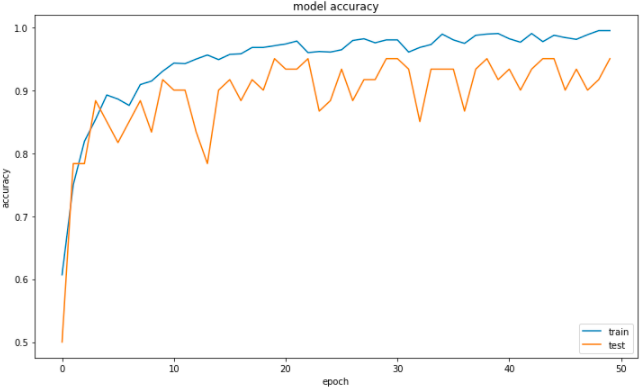
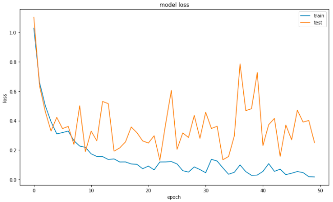
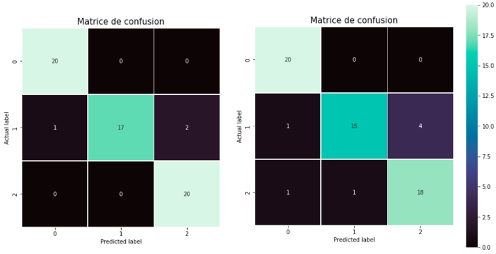
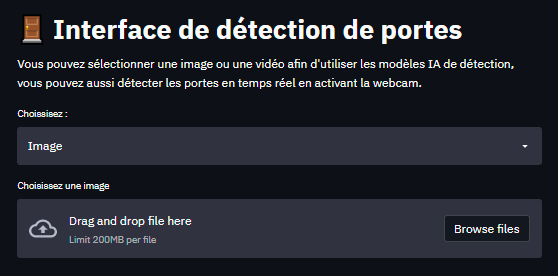
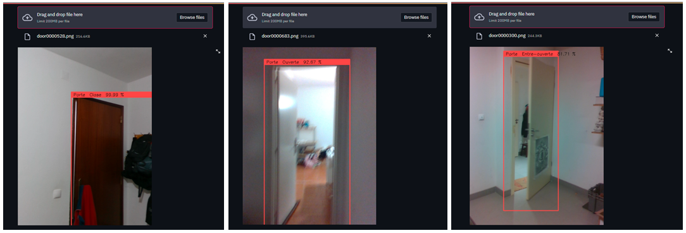
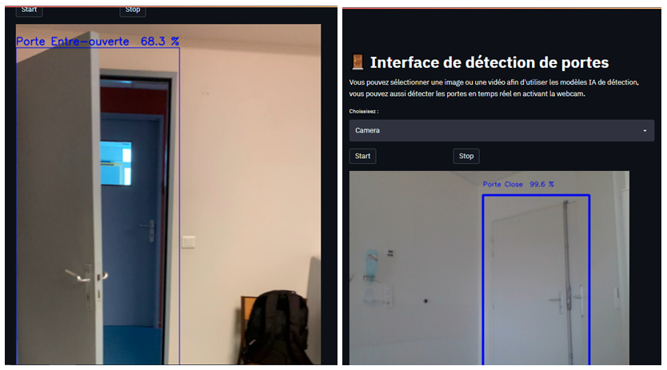

# Epreuve 2 : Amélioration IA

## Contexte
Cette épreuve s’intègre dans l’obtention du Titre Professionnel de Développeur en Intelligence Artificielle. Formant la deuxième partie pratique, le projet a pour but d’améliorer une IA et de créer une interface graphique. Le sujet propose de créer une IA capable de détecter des portes en reportant leur état d’ouverture (ouverte, entre-ouverte ou fermée). Cette étude peut se rapprocher des recherches récentes sur la détection d’obstacle par exemple et portant surtout sur la mise en place de systèmes intelligents mobiles. Ces robots sont représentés sous divers formes et ayant des tâches spécifiques comme les aspirateurs intelligents, des robots de livraison, des robots de sécurité, des systèmes d'aide-soignant, qui aident les personnes en difficulté dans leurs tâches quotidiennes (Zhihao He & Ming Zhu. 2017). Cette problématique peut aussi se rattacher aux mesures de sécurités et de surveillances des portes où plusieurs méthodes de détection et de différenciation des états d’ouverture sont appliquées (B.Quintana et al. 2018).

*Dans notre cas, une entreprise qui propose des solutions technologiques en caméra de surveillance et sécurité a développé un modèle IA capable à détecter et localiser la présence d’une porte à partir d’une image ou vidéo. Cette entreprise cherche à améliorer et étendre cette application pour classifier si la porte détectée par le premier modèle IA est ouverte, fermée ou entre-ouverte.*

Le besoin de cette entreprise est une application Interface Python ou Page Web capable de : 

* Etape 1 : Charger une image, vidéo ou activer la caméra. 
* Etape 2 : Exécuter la localisation et encadre la porte. 
* Etape 3 : Faire retourner le résultat et afficher sur la photo, ou la vidéo le résultat du modèle de classification.

Le modèle de détection de porte a été réalisé en amont et utilise un algorithme YOLO. Ce système de reconnaissance d’objet en temps réel prédit les objets d'une image et les signale sous la forme de cadre (boxes). Les images représentant des portes ont été labélisées dans un premier temps avant d’entraîner le modèle de détection spécifique. YOLO à l’avantage inhérent d’effectuer rapidement ses prédictions en une seule itération, contrairement à d’autres modèles qui détectent les régions d’intérêt séparément de la reconnaissance d’objet.

## Preprocessing
Afin de créer le modèle de classification des portes, un ensemble d’images est proposé dans le cadre de cette épreuve. Le Dataset contient des images en couleur de taille originale (dossier OriginalSize) ou rognée (dossier Cropped)  afin de prendre uniquement en compte la porte.

Chacun de ces dossiers comprend des sous-dossiers prévus pour l’apprentissage du modèle (dossier Train, Valid, Test). Le Dataset est importé sur Google Colab afin que ces images soient traitées avant l’entraînement. Une première réflexion s’est portée sur le choix des images à utiliser dans le développement du modèle de classification. Etant donné que le modèle de détection des portes existe déjà, celui-ci génère un cadre (box) entourant la porte. Il était donc convenable d’utiliser les images du dossier Cropped afin de faire abstraction de l’environnement.

Après définition des Paths, les images Train et Valid peuvent être affichées. Plusieurs vérifications ont été effectuées afin de s’assurer que les données ont bien été importées dans l’environnement Colab.

Le Set Train comprend 548 images de portes ouvertes, 428 de portes fermées, et 110 de porte entre-ouverte. Le Set Valid contient 20 images de chaque catégorie. Afin d’uniformiser la tailles de chacune des images, elles sont redimensionnées avec la méthode cv2.resize en 140 par 140 pixels. Ces images ont été intégrées dans des listes intermédiaires. Elles sont aussi associées à leur label respectif.

Les matrices correspondant à chaque image sont ajoutées dans les listes X_app (données d’entraînement) et X_val (données de validation). Leur label sont quand à eux, ajoutés aux listes y_app et y_val. X_app et X_val sont normalisés avant de les intégrés à l’entraînement du modèle. Les labels sont aussi redimensionnés afin qu’ils puissent être pris en compte dans la dernière couche du modèle de classification. La méthode keras.utils.to_categorical a permis de convertir ces vecteurs simples en matrices. 

## Modélisation d'un classifieur
Portant sur de la classification d’image, le modèle est un réseau de neurones convolutifs (Convolutional Neural Networks CNN). Ces CNN s’inspirent du cortex visuel des animaux. L’ensemble des neurones les constituant permettent de traiter individuellement des portions d’informations contenues dans les images afin d’en ressortir une prédiction et en soit, une classification des images.

  

Pour l'initialisation de ce modèle, les couches Conv2D sont utilisées sur les traitements d'objets bidimensionnels. Le nombre de filtres (ou canaux de convolution) d’entrée commence à 32 (et double à chaque couche intermédiaire), avec une définition de kernel de dimension (3,3) idéale pour des images ayant une taille moyenne de 150x150 pixels.

L'input_shape reprend les dimensions des images fournis au modèle (140x140 pixels en 3 couleurs RGB). Chaque couche est reliée à la suivante par une fonction d’activation reLU, l'activation linéaire standard qui permet de fixer les valeurs négatives de ces matrices à 0. MaxPooling2D réduit les dimensions des images injectées et conserve les traits principaux.

Les dernières couches Flatten et Dense font la liaison entre les couches précédentes et convertissent les données en matrice à 1 dimension. L'activation Softmax retrouvée sur la dernière couche, performant pour la multiclassification, est finalement utilisée.

L’optimizer (descente de gradient) choisi est Adam. La fonction de perte associée (Loss) est categorical_crossentropy prévu pour les problèmes de classification multiple. Le nombre d’Epochs est fixé à 50 pour un batch_size de 16.

Du fait du nombre restreint d’images, de la data-augmentation (ImageDataGenerator) a été effectuée, permettant de créer des copies modifiées de chaque image Train. Ces exemplaires peuvent être zoomés, rognés, décalés sur un axe de rotation.

Afin de sauvegarder les performances maximales (les « poids ») du modèle durant l’entraînement, un *Callback* est initié par la méthode *keras.callbacks.ModelCheckpoint*. Les poids sont enregistrés dans un fichier h5.

A la fin de l’entrainement, le modèle est enregistré lui aussi dans un fichier h5 qui pourra être chargé dans l’éventuelle application. 

## Evaluation du modèle CNN
Les courbes d’apprentissage sur les métriques Accuracy (métrique d’exactitude) et Loss (par la fonction de perte) ont été affichées afin de vérifier l’évolution de l’entraînement du modèle. Un plateau est atteint à la fin de cette phase d’apprentissage. Grâce aux checkpoints, le modèle aux poids optimaux possède une Accuracy de 0.95 pour un Loss de 0.26 sur les données de validation.

  
  

Pour évaluer la répartition des images du set Valid classé par le modèle, une matrice de confusion a aussi été affichée. On rencontre des erreurs de classification sur la catégorie Semi. Le modèle prédit des images représentant des portes closes ou ouvertes alors qu’elles sont entre-ouvertes.

Dans le cas de l’évaluation sur les images de Test (inutilisées durant l’apprentissage et la validation du modèle), il y a davantage d’erreur de prédiction et d’autant plus dans la catégorie Semi. Toutefois la majorité des images sont classées correctement dans leur catégorie respective.

  

## Test sur Application
L'interface a été construit sous *Streamlit*. Utilisant le langage Python, il a pour but de construire des interfaces convenables et facilement sans utiliser de langages Front-end spécifiques. Il a notamment été conçu pour présenter des projets de Machine Learning et de data-science.

Cette application propose d’utiliser les IA modélisées en amont sur différents fichiers, que ce soit des images, des vidéos ou encore permettant la possibilité d’utiliser directement la webcam. Le programme a donc été développé de telle sorte qu’il puisse répondre aux attentes de l’entreprise.
Les modèles de détection et de classification sont chargés, ainsi que les poids optimaux. Une liste contenant les labels des classes disposés dans le même ordre que lors de la création du classifier est aussi déclarée.
Deux fonctions sont créées :

* Une fonction cache_video permet de garder la capture vidéo en cache et permettant l’incorporation simultanée des traitements générés par les modèles IA. Cette fonction est utilisée pour la vidéo et l’utilisation de la caméra.
* Une fonction image_traitement traitant l’image d’entrée et en ressortant la même image avec les cadres de détection de porte et le label de classification (et probabilité).

  

Finalement, un menu permet de naviguer et utiliser les différentes fonctionnalités. Pour les images, il y a la possibilité de les déposées directement sur l’interface. Pour l’utilisation de la caméra et vidéo, des boutons permettent de démarrer ou stopper la lecture :

  

Les tests sur caméra et vidéo se sont bien déroulés. Les portes sont généralement bien détectées et classifiées.  Cependant,  des imprécisions ont été remarquées la détection en temps réel. Des fenêtres, vitres ou autres éléments de forme rectangulaires sont considérés comme des portes par le modèle de détection.

  

## Conclusion
Quelques réseaux CNN, dont l’architecture s’inspire d’autres modèles existant, ont été construits. Le modèle final a été évalué sur deux métriques et présentait de bons résultats, notamment sur les matrices de confusion. Cependant, les courbes d’apprentissage présentent une variabilité de progression conséquente.

Lors de la phase de test sur l’interface graphique, construit sous Streamlit, la plupart des portes présentées dans les photos du set Test sont détectées par le modèle YOLO et correctement classées. Toutefois, sur la détection en temps réel, il existe quelques problèmes de détection et de classification. Le modèle de détection confond certains éléments et les considère comme des portes. Au niveau de la classification, le modèle prévu à cet effet présente quelques difficultés, majoritairement sur les portes entre-ouvertes.

Durant la phase d’entraînement, certaines images mises à dispositions étaient similaires entre les sets Train, Valid et Test, biaisant les véritables performances du modèle CNN de classification. Bien que la data-augmentation ait pu sans doute réduire l’écart entre les performances théoriques et les tests en temps réel, celle-ci n’est pas encore suffisante pour obtenir un modèle robuste et généralisant la classification des porte.

## Perspectives
Par la suite, il serait intéressant d’évaluer le modèle de détection afin de fixer un seuil de probabilité optimal permettant de cibler uniquement les portes. Pour le modèle de classification, augmenter le nombre d’images et éviter de répartir les mêmes portes dans chaque set permettra d’avoir une vision des performances réelles du modèle en fonction de l’architecture adoptée. Plusieurs autres paramètres peuvent être aussi à modifier comme la taille des images d’entrée, l’utilisation d’un plus grand Kernel d’entrée, ajouter des Dropout pour éviter le sous/sur-ajustement, ajuster le batch size, learning rate…
Aussi, il peut être envisageable d’appliquer le principe de transfert learning afin d’associer un modèle pré-entrainé potentiellement plus robuste.

